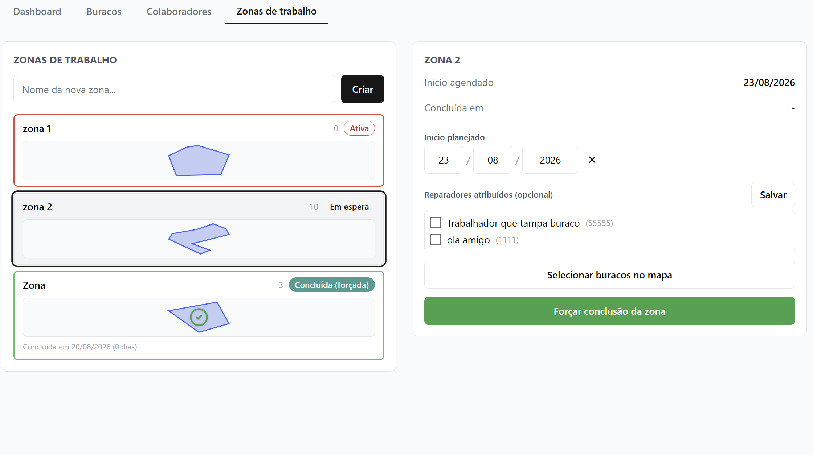
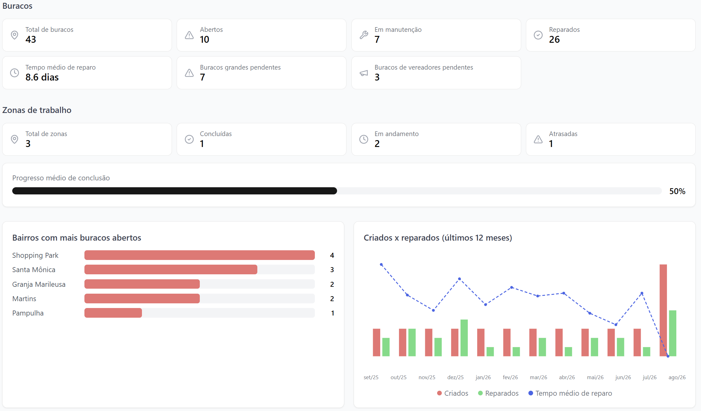
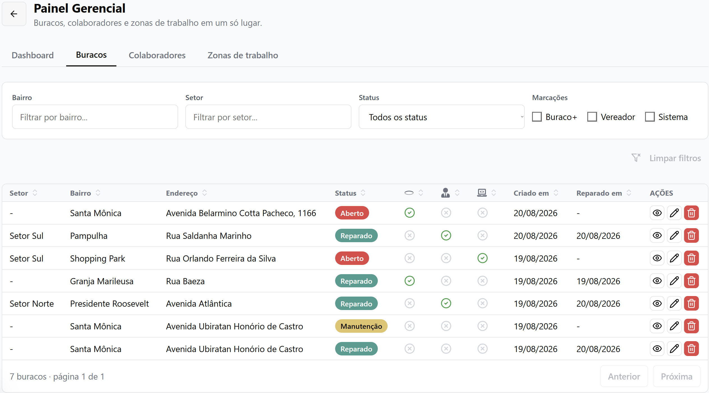

# HoleApp

O HoleApp é um sistema de gestão de buracos em vias urbanas. A ideia é simples: qualquer pessoa autorizada consegue marcar no mapa onde tem um buraco, tirar uma foto, e a partir daí uma equipe de reparo acompanha, organiza e conclui o conserto — tudo isso com controle de quem pode fazer o quê, prazos, e um painel pra quem administra tudo enxergar o panorama geral da cidade.

Comecei esse projeto como um piloto bem simples (só marcar, editar e apagar um ponto no mapa) e fui evoluindo conforme as necessidades reais foram aparecendo: controle de permissões, fotos de antes/depois, zonas de trabalho, colaboradores em tempo real, dashboard com indicadores... hoje é um sistema completo, full stack, do tipo que dá pra usar em produção mesmo.

## O que dá pra fazer no app

**No mapa principal**, qualquer usuário consegue ver os buracos cadastrados na cidade, coloridos por status (aberto, em manutenção, reparado). Buracos grandes e buracos "de vereador" (uma marcação específica que o cliente pediu pra dar prioridade política) aparecem destacados visualmente. Dá pra buscar um endereço, seguir a própria localização em tempo real, e — dependendo do papel do usuário — adicionar um buraco novo tirando uma foto na hora (o app já abre a câmera direto, sem precisar ir na galeria).

**Reparadores** marcam um buraco como "em manutenção" ou "reparado", anexando foto do resultado. Quando uma zona de trabalho tem prazo vencido e ainda não foi concluída, o reparador recebe um aviso assim que abre o app.

**Zonas de trabalho** são áreas desenhadas no mapa (um polígono) que agrupam vários buracos de uma região e são atribuídas a um ou mais reparadores, com prazo de início. Dá pra forçar a conclusão de uma zona inteira de uma vez (todo mundo lá dentro vira "reparado" automaticamente) ou reabrir se foi engano. Na lista de zonas, cada uma mostra uma miniatura do formato da área, quantos buracos tem, e muda de cor conforme o status: cinza pra quem ainda não começou, vermelha pra quem já devia ter começado, verde pra concluída.


Cada card da esquerda é uma zona, com o desenho do polígono em miniatura (esse formato vem exatamente da área que foi desenhada no mapa na hora de montar a zona) e a cor da borda contando o status de longe: vermelho é "ativa" (já devia ter começado e ainda não foi concluída), cinza claro é "em espera" (data ainda não chegou), verde é concluída — e essa em verde ainda mostra quantos dias levou até finalizar. A zona 2 aparece com a borda mais escura porque é a que está selecionada no momento, aberta no painel da direita, onde dá pra reagendar o início, atribuir reparadores, escolher os buracos no mapa ou forçar a conclusão de uma vez.

**Painel administrativo**: dashboard com números (buracos abertos vs. reparados, tempo médio de reparo, bairros mais problemáticos, gráfico dos últimos 12 meses), gestão de colaboradores (criar conta, trocar papel de acesso), e a gestão de zonas descrita acima. Só administrador tem acesso.


Essa é a primeira coisa que o admin vê ao abrir o painel. Os cartões do topo dão o resumo rápido (quantos buracos estão abertos, quantos foram reparados, tempo médio de conserto...), e embaixo tem os bairros com mais buracos abertos e a evolução dos últimos 12 meses — criados vs. reparados, com o tempo médio de reparo plotado como linha em cima das barras.


A aba "Buracos" é a listagem completa, com filtro por bairro, setor, status e as marcações especiais (buraco grande, vereador, sistema). Dá pra ordenar por qualquer coluna e ver/editar/excluir cada registro sem sair da tabela.

Tem também uma camada opcional (só pro admin) que mostra em tempo real onde cada colaborador está no mapa, com a foto de perfil dele dentro de um circulozinho — a borda fica verde se a pessoa está ativa há pouco tempo, vermelha se sumiu, e depois de um tempo maior ela simplesmente some da tela (sem guardar histórico de trajeto, só a posição mais recente).

## Como foi construído

O front é em **Next.js** (App Router) com **React** e **TypeScript**, estilizado com **Tailwind** e alguns componentes do **Radix UI**. O mapa é feito com **Leaflet**/**react-leaflet** — os marcadores, clusters, camadas de zona, tudo isso é renderizado ali em cima do OpenStreetMap.

O back é uma API em **NestJS**, também em TypeScript, com **Prisma** fazendo a ponte com um banco **PostgreSQL** (hospedado no Neon). Autenticação por **JWT**, e as regras de quem pode fazer o quê ficam centralizadas em guards e serviços de autorização.

## Estrutura

```
holeapp/
├── frontend/   → Next.js (interface, mapa, painel administrativo)
└── backend/    → NestJS + Prisma (API, autenticação, regras de negócio, banco)
```

## Rodando localmente

Backend e frontend rodam separados, cada um com seu `npm run dev`.

Variáveis de ambiente do backend (`.env`):

```
DATABASE_URL=
JWT_SECRET=
NODE_ENV=
```

Variáveis do frontend (`.env.local`):

```
NEXT_PUBLIC_API_URL=
NEXT_PUBLIC_IMAGE_HOSTNAME=
NEXT_PUBLIC_IMAGE_PROTOCOL=
NEXT_PUBLIC_IMAGE_PORT=
NEXT_PUBLIC_IMAGE_PATHNAME=
```
